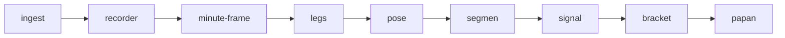

# Methodology — Anti-Overfitting Market Data Infrastructure

**Nature of this work:** data engineering and research methodology.
**This is NOT financial advice, NOT a buy/sell signal, and carries NO profit
promise.** This system is **NO-ORDER** — it does not place, route, or
execute trades in any market.

---

## The problem this addresses

Trading research is easy to fool yourself with: look-ahead leakage lets
future information bleed into a model, overfitting makes a backtest look
great and then collapse live, and dirty/"ghost" market data silently
corrupts everything built on top of it. Most "systems" are sold on promises,
not on a documented, auditable process.

## The pipeline (documented per stage)

A 9-stage, exchange/asset-agnostic market data pipeline with a quality gate
at every handoff:

Each price "leg" is converted into **24 measured features** across 4 groups:

| Group | Example features |
|---|---|
| Structure | size · duration · velocity · ATR |
| Money flow | net-USD/minute · VPIN · Kyle's λ · OFI · Benford conformance |
| Psychology | whale % · CVD · climax detection · absorption |
| Context | fractional differencing · HMM regime · time-of-day · release calendar |

## Disciplines that make this auditable
- **Gate definitions and their failure conditions** — see [GATES.md](GATES.md).
- **Data contracts** — a fixed column schema across pipeline stages; join
  keys are identical across different traded instruments (apple-to-apple
  comparison).
- **Ghost-data quarantine + health monitoring** — corrupted or anomalous
  data is isolated and flagged, never silently used.

## What is NOT in this repository

- No trading signal logic, thresholds, or parameter values.
- No source code for the pipeline stages themselves.
- No historical performance figures, win rates, or backtest results.
- No live or historical market data.

This repository documents *how the process is structured to resist
self-deception* — not what the process outputs. Validation results
(walk-forward statistics, out-of-sample metrics) can be shared under a
scoped, signed NDA for serious engagement inquiries — see contact info in
the main [README](README.md).

## Source of terminology

VPIN, Kyle's λ, order-flow imbalance (OFI), fractional differencing, and
Combinatorial Purged Cross-Validation (CPCV) are established concepts in
market microstructure and quantitative finance research literature. This
document describes how they are combined into a pipeline and validation
process — it does not claim novelty over the underlying published concepts.
