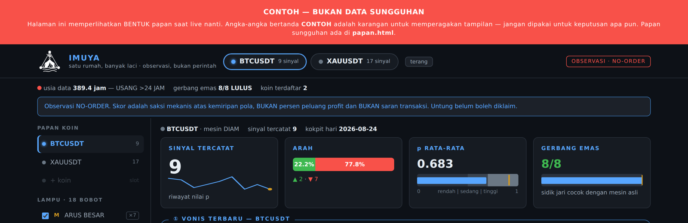

# MESIN INTI — Market Data Engine with Gates That Can Say No

> ## **17 of 20 sabotages were caught. Three got through. All three are published below, with the specimens kept.**

**I learned this in a hospital laboratory that gets inspected. Then I rebuilt the inspection in code.**

[](#citation)
[](MUTATION_REPORT.md)
[](GATES.md)
[](LICENSE)

---

## What this is

A market-data pipeline built so that **every stage has a guard, and every guard can refuse.**

I do not sell signals. I do not send orders. I do not claim returns.
I build pipelines whose output can be audited — and I prove my own guards work by breaking them on purpose.

---

## 1 · The problem

> *"My backtest looks good. I am afraid it is lying to me."*

You have a model. It scored well on your test set. You cannot tell whether it learned something real or memorised noise — and you will only find out with real money.

---

## 2 · Why this happens

1. **The test saw the future.** One column contains information that only exists tomorrow, and it leaked into today's calculation.
2. **The answer became a clue.** A feature was derived, indirectly, from the label it is supposed to predict.
3. **The settings were tuned on the exam.** A threshold was adjusted while looking at test results.
4. **The builder graded the work.** The person who wrote the model also decided whether it passed.
5. **Nothing could fail loudly.** A pipeline that has no gate cannot tell you when it broke — you find out a week later.

---

## 3 · Six gates

Every gate has a defined failure condition. A gate that cannot turn red is decoration.

| Gate | What it checks | What turns it RED |
|---|---|---|
| **G1 · CAUSAL** | Only closed periods are used; entry at t+1, never t | A value that exists only in the future is used in the present |
| **G2 · ZONE** | Predictors and outcome-forensics are separated at birth; the intersection is asserted empty | A feature turns out to be derived from the label |
| **G3 · FROZEN** | Cut-offs are set in-sample, then frozen and fingerprinted | A parameter was tuned while looking at out-of-sample results |
| **G4 · JUDGE** | Purged cross-validation with embargo, run by a separate judge — **plus a label-shuffle test** | The model still "wins" after the labels are shuffled |
| **G5 · COST** | Slippage, fees, and whether the fill was actually achievable | The edge disappears once real costs are applied |
| **G6 · REPEAT** | Run twice with a fixed seed; fingerprints must match byte for byte | Two runs, two different results |

Full definitions: **[GATES.md](GATES.md)**

### Exit codes

```
0 = PASS            this check passed
1 = RED             this check failed — here is the number
2 = CANNOT CHECK    I could not verify this, and here is what I need in order to
```

**Code 2 is not code 0.** "I could not check it" never means "it is safe." Most audits give you pass or fail. This one gives you an honest third answer.

---

## 4 · What you can verify today

### ✅ Available now

| Evidence | Where |
|---|---|
| **Sabotage campaign, 20 mutants, dated** | **[MUTATION_REPORT.md](MUTATION_REPORT.md)** |
| **The three sabotages that survived**, with specimen fingerprints | [MUTATION_REPORT.md § Survivors](MUTATION_REPORT.md#the-three-that-survived) |
| **A live board with two build-blocking guards** | § 6 below |
| **One command that checks every published file against its fingerprint** | `python verify_manifest.py` |

### 🔜 Declared, not yet available

A three-command demo — generate synthetic data, run the gates green, then break one thing and watch a gate turn red — is **not published yet**.

```bash
# planned, not yet available
python make_synthetic.py     # synthetic data with the real schema
python run_gates.py          # all gates -> GREEN
python sabotage_demo.py      # break one thing -> a gate turns RED
```

**Target: within 30 days of this page going live.** Stating a date I can miss is deliberate — see §8.

---

## 5 · One measurement that cost me

On 26 August 2026 I ran a sabotage campaign against my own guards: twenty deliberate code changes at meaningful points — thresholds, fences, secrets, hash chains — then checked which guard screamed first.

**Score: 17 killed, 3 survived (85%).**

The three that survived are published, not deleted:

| # | What the sabotage did | Why my guard was blind |
|---|---|---|
| 4 | Shifted a threshold comparison by one boundary case | At the exact boundary, only the wording of the reason changes; the verdict is the same. No test exercised the exact boundary. |
| 5 | Made a one-minute gap count as an intact series | Tests used gaps of 3 and 30 minutes. The 1–2 minute boundary was never tested. **This is a real blind spot.** |
| 14 | Removed a whitespace check on a drawer name | Redundant — a character-by-character check below it already rejects whitespace. **An equivalent mutant.** |

I wrote this in my own report at the time:

> *"Mutant 14 is an equivalent mutant — counted as survived as it is, **not discarded to make the score look better**."*

> *"The 20 mutants were chosen **by hand** at meaningful points, not at random; **this is therefore not a full mutation score**."*

**Both sentences reduce my number. Both stayed in.**

⚠️ **Scope, stated plainly:** this campaign was run on **AB APPS**, a sibling system built under the same house discipline — **not on this engine**. The same campaign on this engine is the next item of work. I am not claiming a number I did not measure here.

---

## 6 · A guard you can see refuse

<p align="center">
  
</p>

This is the read-only board built by **AB APPS**, the sibling house that displays this engine's verdicts. It is one self-contained HTML file: **no server, and the JavaScript only arranges the display — it computes nothing.**

The board has **two guards at its exit**, and both block the build rather than warn:

| Guard | If it triggers |
|---|---|
| **Disclaimer must be present** | The NO-ORDER disclaimer is missing from the final HTML → **build refused** |
| **No kitchen words** | Any internal term appears in the final HTML → **build refused** |

Both guards were sabotaged in the campaign above. **Both caught it** (mutants 16 and 17).

### What the board declares about itself

The interface is in Indonesian. Reading the screenshot left to right:

- 🔴 **Red banner:** *"EXAMPLE — NOT REAL DATA."* Numbers marked CONTOH are invented to demonstrate the layout.
- 🏷️ **Every card is labelled individually** — `HIDUP` (live) or `CONTOH` (example). Not a blanket claim: a per-element declaration.
- ⏱️ **`usia data 389.4 jam — USANG >24 JAM`** — the board reports its own data as **389.4 hours old, flagged STALE**. It does not hide its age.
- 🚩 **`OBSERVASI · NO-ORDER`** — top right, permanent.
- 📊 **`p 0.683`** with the caption *"pattern similarity, **NOT** a probability of profit."*
- 📋 **`5 live · 4 partial · 5 not yet`** — most of the lamps are unfinished, and the board says so on its own face.

> A dashboard that announces its own data is stale, labels every element as live-or-demo, and refuses to build without its risk disclaimer — that is the whole discipline, visible in one picture.

[Full board →](images/board_full.png)
An earlier static UI mockup of the cockpit view is in `mockup/`.
---

## 7 · What is not here, and will not be

Tuned values — thresholds, model weights, calibration constants, and the frozen reference library — are **not in this repository**. That is the boundary between the method and the recipe.

What **is** here: the discipline around them, the gate definitions, the exit-code contract, and a dated record of my own guards being tested to destruction.

---

## 8 · What you can hold me to

> **Every report states what I could NOT check, and what I would need in order to check it. If that section is missing, the report is defective.**

Two further commitments on this page, both dated and both able to embarrass me:

- The three-command demo in §4 ships **within 30 days** of this page going live, or this section says why it did not.
- The sabotage campaign runs on **this engine**, and the number is published **whatever it is** — including if it is worse than 17/20.

---

## 9 · Status

| | |
|---|---|
| **Version** | v0.1.0 |
| **Status** | Documentation release — core logic is private by design |
| **Sabotage campaign** | 17/20 on AB APPS, 26 Aug 2026 · **not yet run on this engine** |
| **Board** | Production; screenshot above is the preview build |
| **Last updated** | 12 September 2026 |

### Standards this follows

- **FAIR** (Wilkinson et al. 2016) and **FAIR for Research Software** (Barker et al. 2022)
- **Software Citation Principles** (Smith, Katz & Niemeyer 2016)
- Structured to the criteria ACM defines for *Artifacts Evaluated — Functional* (ACM v1.1, 2020): documented, consistent, complete, exercisable
- **Modelled on accredited-laboratory practice.** I work in a hospital laboratory that undergoes accreditation, and rebuilt those techniques — documented methods, validation before use, provenance, specimen rejection criteria — in code.

> ⚠️ **This software is not accredited and not certified.** No accreditation body has assessed it. "Lab-grade" describes how it is built, not a credential it holds.

---

## Disclaimer

**NO-ORDER.** This is data infrastructure and verification discipline. It is not a signal service, not investment advice, and makes no claim about returns. The engine has never sent an order and is not built to.

Full text: **[DISCLAIMER.md](DISCLAIMER.md)**

---

## Citation

See `CITATION.cff` — GitHub renders a **Cite this repository** button from it.

## Contact

**Iqbal Muhammad Yasin** — Jakarta, Indonesia
ORCID [0009-0007-2277-6917](https://orcid.org/0009-0007-2277-6917)
